<h1 align="center">Hi 👋, I'm Andrew Melad</h1>

<h3 align="center">
  Frontend Developer | React, Vue, Next.js & React Native
</h3>

  

  

  

  

---

# 🚀 About Me

- 🔭 I’m currently working on **AI Personal Assistants**
- 🌱 I’m currently learning **AI Automation SaaS**
- 💻 I enjoy building responsive, scalable and user-friendly web applications
- ⚡ I’m interested in frontend architecture, automation and AI-powered products
- 🤝 I’m open to collaborating on frontend, mobile and SaaS projects

### 💬 Ask Me About

- React and Next.js
- Vue.js
- React Native
- JavaScript and TypeScript
- Frontend architecture
- REST APIs and Node.js
- AI automation workflows
- Responsive UI development

### 🧠 Tech Stack I’m Exploring

- Next.js
- Neon Database
- Inngest
- Better Auth
- Cryptomus
- AI Automation
- SaaS Architecture

---

# 🌐 Connect With Me

  

  

---

# 🛠 Languages & Tools

<h3 align="center">Frontend Development</h3>

  

<h3 align="center">Styling & UI</h3>

  

<h3 align="center">Backend & Databases</h3>

  

<h3 align="center">Tools & Systems</h3>

  

  

---

# ⚡ GitHub Profile Summary

  

<table>
  <tr>
    <td width="49%" align="center">
      
    </td>

    <td width="50%" align="center">
      
    </td>
  </tr>

  <tr>
    <td width="49%" align="center">
      
    </td>

    <td width="50%" align="center">
      
    </td>
  </tr>
</table>

---

# 🔥 GitHub Streak

  

---

# 📈 Contribution Activity Graph

  

---

# 📊 Complete GitHub Overview

  

---

# 🗓️ Full-Year Contribution Calendar

  

---

# 🐍 Contribution Snake

  <picture>
    <source
      media="(prefers-color-scheme: dark)"
      srcset="./assets/github-snake-dark.svg"
    />

    <source
      media="(prefers-color-scheme: light)"
      srcset="./assets/github-snake.svg"
    />

    
  </picture>

---

# 💡 Developer Quote

  

---

# ☕ Support & Contact

  Have an idea, project or collaboration opportunity?

  

  

 

  <i>
    GitHub statistics and profile assets are automatically updated every day
    using GitHub Actions.
  </i>

