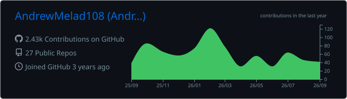
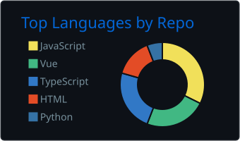
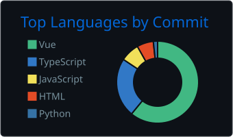
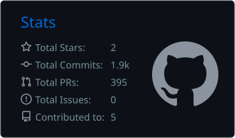
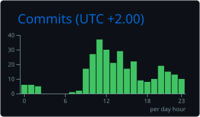

<h1 align="center">Hi 👋, I'm Andrew Melad</h1>

<h3 align="center">
  Software Engineer | Full-Stack, Frontend & Mobile Development
</h3>

  

  

  

  

---

# 🚀 About Me

* 💼 Software Engineer working across **frontend, backend and mobile applications**
* 🚚 Worked on **ShipBlu**, improving merchant and customer-facing web applications
* 📱 Built the first functional version of the **ParcelPay Mobile App** using React Native and TypeScript
* ⚙️ Built backend APIs, database schemas, integrations and tests for **ParcelPay Backend**
* 🛒 Built **Al Mtger**, a merchant dashboard for products, orders, customers, payments and storefront management
* 🧩 I enjoy building reusable component systems and improving existing application architecture
* 🐛 I focus on solving real-world issues around APIs, authentication, permissions, performance and edge cases
* 🤖 Interested in AI-powered products, automation and SaaS development
* 🤝 Open to collaborating on web, mobile, backend and SaaS projects

### 💬 Ask Me About

* React & Next.js
* Vue.js
* React Native & Expo
* JavaScript & TypeScript
* Frontend architecture & design systems
* Node.js & Express.js
* REST APIs
* PostgreSQL & TypeORM
* Authentication & authorization
* API validation with Zod & oRPC
* Jest & Supertest
* Responsive UI & RTL/LTR support
* AI integrations & automation workflows

### 🧠 Currently Exploring

* Next.js
* React Query
* Better Auth
* Neon Database
* Inngest
* AI Automation
* n8n
* SaaS Architecture

---

# 🌐 Connect With Me

  

  

---

# 🛠 Languages & Tools

<h3 align="center">Frontend Development</h3>

  

<h3 align="center">Mobile Development</h3>

  
  

<h3 align="center">Styling & UI</h3>

  

<h3 align="center">Backend Development</h3>

  

  
  
  

<h3 align="center">Databases</h3>

  

<h3 align="center">Testing</h3>

  
  

<h3 align="center">Tools & Systems</h3>

  

---

# 💼 Featured Work

### 🚚 ShipBlu

Worked on the ShipBlu platform across merchant and customer-facing applications, improving reusable UI components, tables, filters, analytics, notifications and order workflows. Also solved issues around responsive behavior, API data handling and frontend maintainability.

### 🌐 Customer Portal

Migrated the Customer Portal to React while preserving the existing functionality and restructuring the application for smoother AWS deployment and easier future maintenance.

### 📱 ParcelPay Mobile App

Built the first functional ParcelPay mobile experience using React Native and TypeScript, including OTP authentication, onboarding, Arabic/English support, shipment tracking, profiles, saved addresses, Google Maps and REST API integration.

### ⚙️ ParcelPay Backend

Built backend APIs and database structures for shipments, addresses, tracking events, ratings and external integrations using Node.js, TypeORM, PostgreSQL, Zod and oRPC. Added authentication, API-key integrations and integration testing with Jest and Supertest.

### 🛒 Al Mtger

Built a Vue 3 and TypeScript merchant dashboard for managing products, orders, customers, checkout links, payments, shipping and storefront customization. Worked on reusable validation, custom fields, image management, responsive previews, RTL/LTR support, permissions, token refresh and complex API edge cases.

### 🤖 AI Personal Assistants

Built a full-stack application featuring 10 specialized AI assistants using Next.js, React, Node.js and external AI models to support different daily tasks through an interactive experience.

---

# ⚡ GitHub Profile Summary

  

  
  

  
  

---

# 🔥 GitHub Streak

  

---

# 📈 Contribution Activity Graph

  

---

# 📊 Complete GitHub Overview

  

---

# 🗓️ Full-Year Contribution Calendar

  

---

# 🐍 Contribution Snake

  <picture>
    <source
      media="(prefers-color-scheme: dark)"
      srcset="./assets/github-snake-dark.svg"
    />
    <source
      media="(prefers-color-scheme: light)"
      srcset="./assets/github-snake.svg"
    />
    
  </picture>

---

# 💡 Developer Quote

  

---

# ☕ Support & Contact

  Have an idea, project or collaboration opportunity?

  

  

 

  <i>
    GitHub statistics and profile assets are automatically updated every day
    using GitHub Actions.
  </i>

